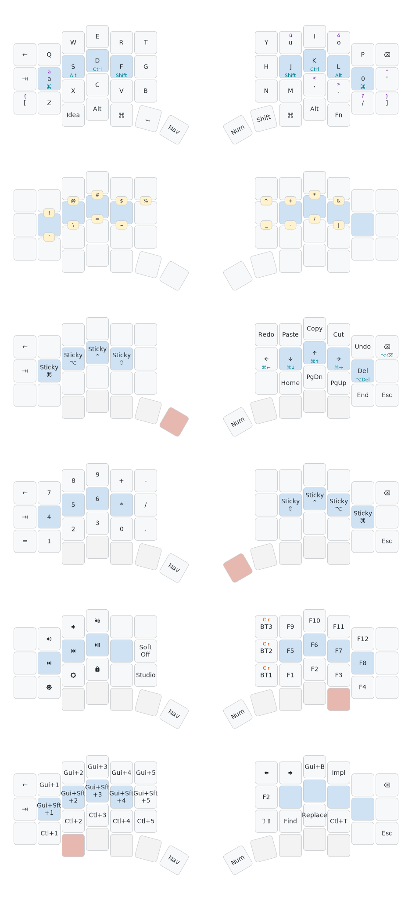

# ZMK Config for Anywhy Flake M

Personal ZMK keymap for the [Anywhy Flake M](https://github.com/anywhy-xyz/zmk-module-anywhy) (46-key split ergonomic keyboard), heavily inspired by [urob's zmk-config](https://github.com/urob/zmk-config).

## Features

### Home Row Mods
[Timeless home row mods](https://github.com/urob/zmk-config?tab=readme-ov-file#timeless-homerow-mods) with Miryoku-style modifier order:

| Left Hand | Right Hand |
|-----------|------------|
| A = ⌘ Cmd | J = ⇧ Shift |
| S = ⌥ Alt | K = ⌃ Ctrl |
| D = ⌃ Ctrl | L = ⌥ Alt |
| F = ⇧ Shift | ; = ⌘ Cmd |

**Tuning**: `tapping-term-ms=280`, `quick-tap-ms=175`, `require-prior-idle-ms=150`

### Tap-Dance (Double-Tap)
German umlauts and punctuation via double-tap:

| Tap | Double-Tap |
|-----|------------|
| a | ä |
| o | ö |
| u | ü |
| ' | " |
| [ | { |
| ] | } |
| , | < |
| . | > |
| / | ? |

Umlauts use macOS dead keys (`Option+U` then vowel) - works on standard U.S. keyboard layout.

### NAV Layer
Inspired by [urob's nav cluster](https://github.com/urob/zmk-config?tab=readme-ov-file#nav-cluster):

- **Arrow keys** with hold for line/document navigation:
  - Tap: ← ↓ ↑ → 
  - Hold: ⌘← (line start), ⌘↓ (doc end), ⌘↑ (doc start), ⌘→ (line end)
- **Delete keys** with hold for word deletion:
  - Tap: ⌫ / Del
  - Hold: ⌥⌫ (word back) / ⌥Del (word forward)
- **Sticky modifiers** on left hand (⌘, ⌥, ⌃, ⇧)
- **Clipboard keys**: Undo, Cut, Copy, Paste, Redo

### Vertical Combos
[urob-style vertical combos](https://github.com/urob/zmk-config?tab=readme-ov-file#combos) for symbols:

| Combo | Symbol |
|-------|--------|
| Q+A | ! |
| W+S | @ |
| E+D | # |
| R+F | $ |
| T+G | % |
| Y+H | ^ |
| U+J | & |
| I+K | * |
| O+L | ( |
| P+; | ) |

### Additional Layers

- **NUM**: Numpad layout with sticky mods
- **FN**: F-keys, media controls, brightness, Bluetooth
- **Idea**: IntelliJ IDEA shortcuts

### Bluetooth
- 5 profiles (BT1-BT5)
- Clear profile: Shift + BTx on FN layer

## Building

Firmware builds automatically via GitHub Actions on push. Download from the [Actions tab](../../actions).

## Keymap Visualization

Generated with [keymap-drawer](https://github.com/caksoylar/keymap-drawer). SVG updates automatically on keymap changes.

## Credits

- [urob/zmk-config](https://github.com/urob/zmk-config) - Home row mods, nav cluster, combos
- [Anywhy](https://github.com/anywhy-xyz) - Flake keyboard
- [keymap-drawer](https://github.com/caksoylar/keymap-drawer) - Visualization
